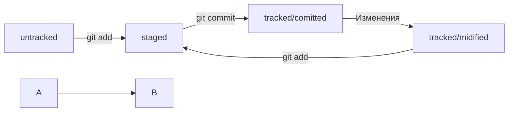

# **Шпаргалка по git.**  
Git — это система контроля версий, которая помогает отслеживать изменения в проекте. 
## **Сделать папку репозиторием**  
ввести команду git init
## **«Разгитить» папку, если что-то пошло не так**
нужно удалить скрытую подпапку .git  
rm -rf .git  
ключ -r позволяет удалять папки вместе с их содержимым  
ключ -f избавит вас от вопросов вроде «Вы точно хотите удалить этот файл?  
## **Проверить состояние репозитория**
запустите команду git status  
## **Подготовить файлы к сохранению**  
использовать команду git add <имя файла>, git add --all, git add .
## **Выполнить коммит**
```
$ git commit -m ‘Мой первый коммит!’
```  
## **Просмотреть историю коммитов**  
git log  
# **GitHub**  
## *Инструкция по созданию репозитория на GitHub*  
1. Зайдите в свой профиль  
2. Создайте репозиторий. Для этого перейдите на вкладку Repositories (англ. «репозитории»), а затем нажмите на зелёную кнопку New (англ. «новый») справа.  
3. Открылось окно создания нового репозитория. Назовите его. Название удалённого репозитория необязательно должно совпадать с именем папки проекта у вас на компьютере.  
## **SSH-ключ**  
**Проверка наличия SSH-ключа**  
По умолчанию директория с SSH-ключами находится в домашней директории пользователя.
```
$ ls -la .ssh/ # вывели список созданных ключей
```
**Инструкция по генерации SSH-ключа**  
1. можно использовать программу ssh-keygen  
```
$ ssh-keygen -t ed25519 -C "электронная почта, к которой привязан ваш аккаунт на GitHub"
```
2. Укажите место хранения ключей. Простой вариант — сделать домашний каталог пользователя путём по умолчанию.  
```
> Enter a file in which to save the key (C:\Users\<имя_пользователя>\.ssh\):[Press enter]
```
3. Программа запросит кодовую фразу  
```
> Enter passphrase (empty for no passphrase): [Type a passphrase]
> Enter same passphrase again: [Type passphrase again]
```
4. Проверить, что ключи действительно сгенерировались  
```
ls -a ~/.ssh
```
На экране должны появиться два файла — один с расширением .pub, другой — без. Файл в .pub — публичный, им можно делиться с веб-сайтами или коллегами. Файл без расширения .pub — приватный.  
## **Инструкция по связыванию SSH-ключа и GitHub-аккаунта**  
1. После выполнения команды ssh-keygen в директории ~/.ssh будет создано два файла — id_ed25519 и id_ed25519.pub или id_rsa и id_rsa.pub — в зависимости от того, какой алгоритм вы использовали. Скопируйте содержимое файла с публичным ключом в буфер обмена.  
```
$ clip < ~/.ssh/id_rsa.pub
# для ed25519:
$ clip < ~/.ssh/id_ed25519.pub
```
Если clip не сработает, выведите содержимое файла с помощью cat ~/.ssh/id_rsa.pub или cat ~/.ssh/id_ed25519.pub и скопируйте вывод в буфер обмена из консоли.  
2. Перейдите на GitHub и выберите пункт Settings  
3. В меню слева нажмите на пункт SSH and GPG keys.  
4. В открывшейся вкладке выберите New SSH key  
5. В поле Title (англ. «заголовок») напишите название ключа. Например, Personal key (англ. «личный ключ»).  
6. В поле Key type (англ. «тип ключа») должно быть Authentication Key (англ. «ключ аутентификации»).  
7. В поле Key скопируйте ваш ключ из буфера обмена.  
8. Нажмите на кнопку Add SSH key  
9. Проверьте правильность ключа  
```
$ ssh -T git@github.com
```
Если это первый раз, когда вы используете Git, чтобы поделиться проектом на GitHub, появится похожее предупреждение.  
```
The authenticity of host 'github.com (140.82.121.4)' can't be established. ED25519 key fingerprint is SHA256:+DiY3wvvV6TuJJhbpZisF/zLDA0zPMSvHdkr4UvCOqU. This key is not known by any other names. Are you sure you want to continue connecting (yes/no/[fingerprint])?
```
Это предупреждение сообщает, что вы никогда не соединялись с сервером GitHub. Поэтому Git не может гарантировать, что сервер является тем, за кого он себя выдаёт. Для подтверждения подлинности сервер генерирует и публикует ключи SHA256. Вы можете проверить ключи [по этой ссылке](https://docs.github.com/en/authentication/keeping-your-account-and-data-secure/githubs-ssh-key-fingerprints)  
Если ключ в предупреждении совпадает с тем, что вы видите на сайте, значит, сервер является действительным. Введите yes, чтобы продолжить. Вы увидите приветствие на экране.
```
Hi %ВАШ_АККАУНТ%! You've successfully authenticated, but GitHub does not provide shell access.
```
Связываем локальный и удалённый репозитории  
Привязать удалённый репозиторий к локальному  
## **Добавить удалённый репозиторий**
```
git remote add <имя> <url>
```
## **Отправить изменения на удалённый репозиторий**  
В первый раз эту команду нужно вызвать с флагом -u и параметрами origin (имя удалённого репозитория) и main или master (название текущей ветки). 
```
$ git push -u origin main # Если команда приведёт к ошибке, попробуйте 
                          # заменить main на master.
```
## **Элементы описания коммита**  
git log  
Получить сокращённый лог — git log --oneline  
## **Файл HEAD**  
Внутри HEAD — ссылка на служебный файл: refs/heads/master (или refs/heads/main в зависимости от названия ветки). Если заглянуть в этот файл, можно увидеть хеш последнего коммита.  
# **Статусы файлов в Git**  
Статусы untracked/tracked, staged и modified  

## **Как исправить коммит**  
Дополнить коммит новыми файлами 
```
$ git commit --amend --no-edit
```
С опцией --amend команда commit не создаст новый коммит, а дополнит последний, просто добавив в него файл.  
Обратите внимание на опцию --no-edit. Она сообщает команде commit, что сообщение коммита нужно оставить как было.  
Точно так же можно добавить не новый файл, а дополнительные изменения в уже добавленном в коммит файле.  
## **Изменить сообщение коммита**  
git commit --amend -m "Новое сообщение"  
--amend рассчитан на работу с последним коммитом (HEAD).  
## **Как откатиться назад**  
Выполнить unstage изменений — git restore --staged <file>  
Чтобы «сбросить» все файлы из **staged** обратно в untracked/modified, можно воспользоваться командой git restore --staged .: она сбросит всю текущую папку (.).  
## **«Откатить» коммит**  
git reset --hard <commit hash>  
Удаляет коммиты, сделанные после коммита к которому откатились.  
## **«Откатить» изменения, которые не попали ни в staging, ни в коммит**  
Может быть так, что вы случайно изменили файл, который не планировали. Теперь он отображается в Changes not staged for commit (modified). Чтобы вернуть всё «как было», можно выполнить команду git restore <file>.  
Изменения в файле «откатятся» до последней версии, которая была сохранена через git commit или git add.  
## **Просматриваем изменения в файлах**  
git diff  
Коротко разберём остальные строки вывода команды:  
1. Первые две строки (diff --git a/... b/... и index 901da07..ac459e1 100644) — это низкоуровневая техническая информация.  
2. Строки --- a/teremok.txt и +++ b/teremok.txt говорят, что дальше будет выведен результат сравнения файлов a/teremok.txt и b/teremok.txt — исходной и текущей версий.  
3. бщает, какие строки файла попали в сравнение. Выражение 1,2 (неважно, с плюсом или с минусом) говорит, что были использованы две строки, начиная с первой.  
Выражение со знаком минус (-1,2) относится к «оригинальной» версии файла (a/teremok.txt), а со знаком плюс (+1,2) — к «изменённой» (b/teremok.txt).  
## **Просматриваем изменения в staging area**  
о умолчанию команда git diff не показывает изменения в staged-файлах — только в modified.  
ужно использовать флаг --staged: git diff --staged.  
## **Сопоставляем коммиты**  
### *Дописываем строку в файл*  
Для этого подходит команда echo  
эта команда просто выводит в консоль то, что ей передали в качестве параметра.  
Но если скомбинировать echo с символами перенаправления вывода >> (два знака «больше»), то всё, что должно было попасть на экран, вместо этого будет записано в файл.  
Оператор >> — это возможность командной строки (Bash). Его можно использовать не только с echo, но и с любой другой командой, которая выводит что-то на экран.  
Одинарный символ > тоже перенаправит вывод команды в файл, но перед этим сотрёт содержимое файла, то есть перезапишет файл целиком.  
Передайте команде git diff хеши обоих коммитов.  
# **Игнорирование файлов в Git**  
С точки зрения Git .gitignore — это обычный текстовый файл. Его добавляют в корень репозитория и тоже коммитят.  
### * какие в нём могут встречаться строки и как выглядят шаблоны*  
### *Комментарий*  
Если строка начинается с #, то это комментарий, и .gitignore не будет его учитывать.  
### *Просто название файла*  
### *Звёздочка (*)*  
Символ звёздочки (*) соответствует любой строке, включая пустую. Если такой символ используется в шаблоне в .gitignore, значит, файл будет проигнорирован вне зависимости от того, что будет на месте звёздочки.  
```
# игнорировать все файлы, которые заканчиваются на .jpeg
*.jpeg

# игнорировать все файлы "tmp" во всех подпапках папки docs
docs/*/tmp
```
### *Вопросительный знак (?)*  
Вопросительный знак ? соответствует одному любому символу.  
### *Квадратные скобки ([…])*  
Квадратные скобки, как и вопросительный знак, соответствуют одному символу. При этом символ не любой, а только из списка, который указан в скобках.  
В скобках можно либо перечислить символы ([abc]), либо задать диапазон ([a-z]).  
### *Слеш (/)*  
Косая черта, или слеш (/), указывает на каталоги.  
Если шаблон в .gitignore начинается со слеша, то Git проигнорирует файлы или каталоги только в корневой директории.  
```
# игнорировать todo.txt в корне репозитория
/todo.txt

# для сравнения: spam.txt будет игнорироваться во всех папках
spam.txt
```
```
# игнорировать папку build
build/
```
### *Парные звёздочки (**)*  
Функция парных звёздочек (**) похожа на функцию одинарной (*). Отличие в том, как они работают с вложенными папками. Двойная звёздочка может соответствовать любому количеству таких папок (в том числе нулю). Одинарная может соответствовать только одной.  
```
# игнорировать файлы "docs/current/tmp", "docs/old/tmp",
# а также "docs/old/saved/a/b/c/d/tmp"
# и даже "docs/tmp", потому что ноль вложенных папок тоже подходит
docs/**/tmp

# игнорировать только "docs/current/tmp" и "docs/old/tmp"
# файл "docs/old/saved/a/b/c/d/tmp" не попадает в правило
docs/*/tmp
```
### *Восклицательный знак (!)*  
Любое правило в файле .gitignore можно инвертировать с помощью восклицательного знака (!).  
```
# игнорировать все JPEG-файлы
*.jpeg

# но только не мем с Doge
!doge.jpeg
```
Игнорируемые файлы не отображаются в выводе команды git status, иначе они бы засоряли вывод.  
Если всё же нужно отобразить все игнорируемые файлы, то это можно сделать с помощью ключа --ignored: git status --ignored  
