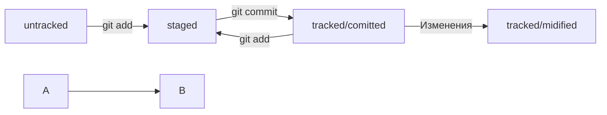

```mermaid
graph LR;
  untracked -- "git add" --> staged;
  staged    -- "git commit"     --> tracked/comitted;
  tracked/comitted    -- "Изменения"     --> tracked/midified;
  tracked/comitted    -- "git add"     --> staged;

%% стрелка без текста для примера: 
  A --> B;
```